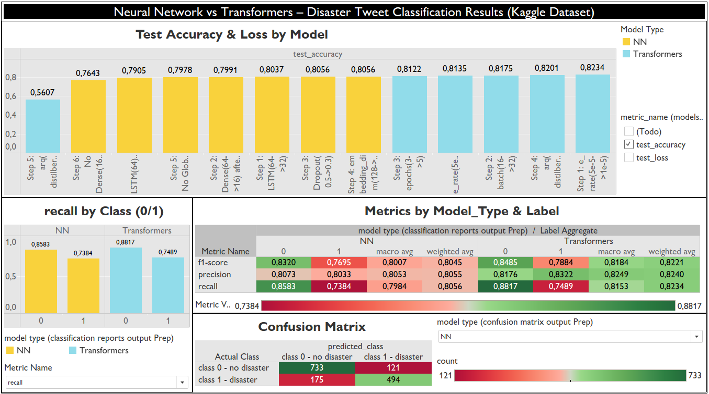

# Disaster Tweets Classification 🧠🌍

This repository contains an end-to-end machine learning project based on the [Kaggle "Real or Not? NLP with Disaster Tweets"](https://www.kaggle.com/competitions/nlp-getting-started) dataset. The goal is to classify whether a tweet is about a real disaster or not.

We cover the complete pipeline: from data upload to AWS RDS, ETL and cleaning, training and evaluating deep learning models (NNs and Transformers), to interactive dashboard creation in Tableau.

---

## 🔧 Project Structure
disaster-tweets-classification/
│
├── notebooks/ # All Python notebooks used for data and model pipelines
├── tableau/ # Tableau dashboard (.twbx) and screenshots
├── prep/ # Tableau Prep flow overview
├── data/ # (Placeholder) Local CSVs from Kaggle – not included in repo
└── README.md # This file

---

## 📦 Data Source

The dataset was downloaded from Kaggle and includes:
- `train.csv`: 7,613 labeled tweets
- `test.csv`: 3,263 unlabeled tweets

CSV files were **uploaded to an AWS RDS instance** (PostgreSQL) using SQLAlchemy in a Jupyter Notebook.

---

## 🔄 ETL & Preprocessing

ETL and cleaning steps were handled using:
- **PostgreSQL (AWS RDS)** for centralized storage
- **SQL queries** for cleaning and preparing data
- **Tableau Prep** for advanced joins, transformations, and pivoting of model output metrics

Three transformed tables were exported back to RDS from Tableau Prep and later used in Tableau Desktop.

---

## 🧠 Model Training

We trained two families of models:
1. **Neural Networks (NNs)** – Multiple configurations using Keras
2. **Transformers** – Fine-tuning DistilBERT using HuggingFace 🤗

Each model was evaluated using:
- Accuracy, Precision, Recall, F1-Score
- Confusion Matrix
- Classification Report

Results were saved and merged for visualization purposes.

---

## 📊 Tableau Dashboard

A full dashboard was created using **Tableau Desktop** and published to [Tableau Public](#) (https://public.tableau.com/app/profile/eros1782/vizzes). It includes:
- F1-Score by class (0 = no disaster, 1 = disaster)
- Confusion Matrix heatmap
- Accuracy and Loss by model
- Comparison of classification metrics using a color-coded table

All Tableau visualizations use the data extracted from the AWS RDS tables prepared in Tableau Prep.

---

## Visualizations

### Tableau Prep Flow

### Tableau Dashboard

---

## 📌 Highlights

- 🛠️ Full ETL pipeline on cloud infrastructure (AWS RDS)
- 🤖 Deep Learning with both classic NNs and modern Transformers
- 📈 Interactive visual analytics in Tableau
- 🔄 Modular, reproducible structure for deployment or reuse

---

## 🚀 How to Use

1. Clone the repo:  
   `git clone https://github.com/NirgalFromMars/disaster-tweets-classification.git`

2. (Optional) Set up a Python environment using requirements.txt (to be added)

3. Open and explore the Jupyter Notebooks in the `/notebooks` folder

4. Open `dashboard.twbx` with Tableau Desktop or view it online via Tableau Public

---

## 📚 Credits

- Dataset: [Kaggle NLP Disaster Tweets Competition](https://www.kaggle.com/competitions/nlp-getting-started)
- Transformer models: HuggingFace 🤗
- Visualizations: Tableau Desktop + Tableau Prep

---

## 🧩 License

This project is open-sourced under the MIT License.
